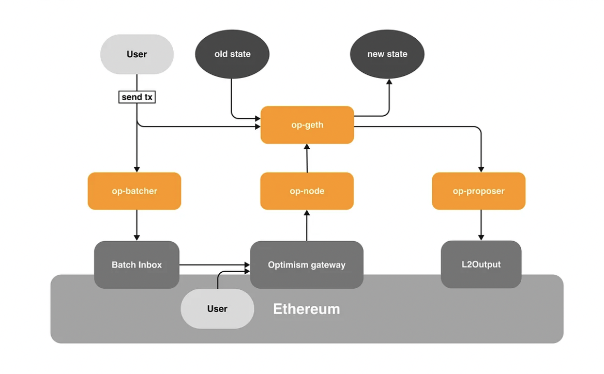
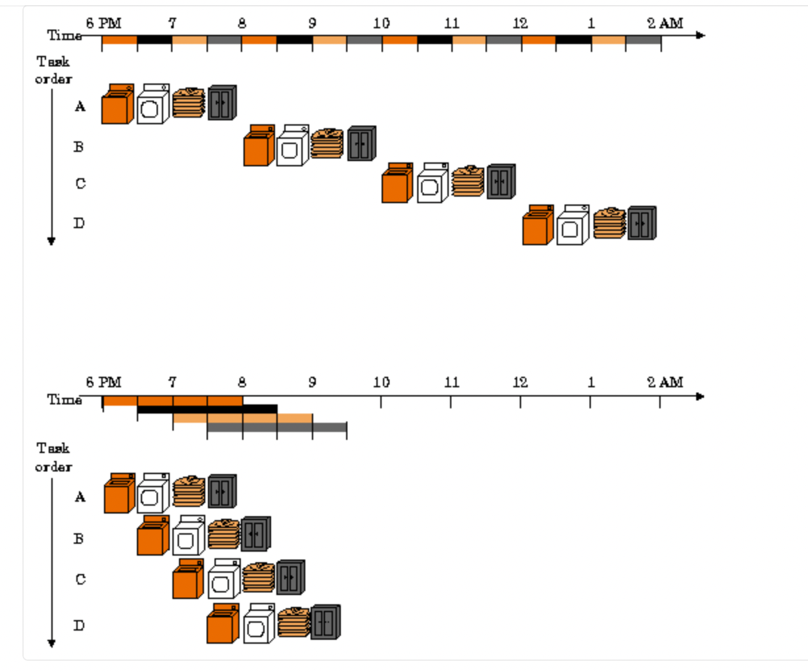

## 基于OP Stack 构建极致性能layer2的一些想法

本篇文章从工程实现角度描述了极致性能layer2的构建


- OP Stack模块有哪些,架构如何
    - OP Stack架构
    - L2一笔交易的生命周期
    - Geth架构
    - Geth源码分析
    - Monad优化点

- 实际项目当中如何修改代码 
    - 如果要修改哈希算法，需要修改哪些

- 使用其它框架搭建layer2的考虑

- 如何基于Op stack构建极致性能layer2


### OP Stack模块有哪些,架构如何

- OP Stack架构

    

    | 模块| 描述| 
    | -- | -- |
    | op-geth| 这是一个交易执行层，类似ethereum的geth。接收用户发送过来的交易，提供JSON-RPC服务，存储`block`, `transaction`数据|
    | op-node| 通过标准以太坊引擎API将来自DA层的数据转换为执行层的input数据；处理L2的排序器交易，区块数据和存储取款交易事件.功能包括L2充值和提现，L2状态更新，和提供L1 Gas价格等|
    | op-batcher| 向以太坊写入压缩的交易(calldata)数据|
    | op-proposal| 更改L1区块链上`L2OutputOracle`的`state root`,提供欺诈证明承诺|
    | L1 合约| L1 合约是 资产跨链 相关合约|

- L2一笔交易的生命周期

    - 用户提交一笔tx首先进入`op-geth`的JSON-RPC服务层
    - `op-geth`接收到交易后，将其放入内存池. 内存池有两条队列，一条是pending_queue(交易验证未通过), 一条是waite_queue(交易已验证通过)
    - `op-geth`打包一个区块，将区块塞入channel，此时区块存放在channel，并未被实际打包
    - `op-node`传递L1数据给`op-geth`, `op-geth`收到数据后进行实际出块流程, getblock获取的区块将产生新数据
    - `op-batcher`定时将区块数据写入L1链，此时区块状态变finalize
    - `op-proposal`仅与资产跨链有关

    显然，如果提升layer2性能，需要重点关注op-geth(如何加速一笔交易的执行并落库), op-node(排序器优化，DA层写入eigenlayer加速区块确认).下面着重介绍op-geth/geth架构.

- Geth架构

    `op-geth`是fork `geth`而来，其大致架构跟`geth`一样，全兼容evm. 下述是关于Geth大致架构.

    Geth从黄皮书到现在的变化主要集中在EVM, MPT, DB,其架构并未有大的变化. 这里使用其pow时期的架构图.


    

    - geth client模块
    - 核心数据结构模块
    - 状态管理模块
        - state DB模块
        - Trie数据结构模块
        - prune优化
    - 挖矿模块(POS, BFT, POA) 
    - EVM模块
    - P2P网络模块
        - 节点数据同步
            - 交易数据
            - 区块数据
        - 内存池
    - Storage模块
        - 数据库接口层
        - LevelDB调用

- Geth源码分析    

    - main函数启动流程

        ```
        func main() {
            ...
            //设置节点初始化配置
            prepare()

            //实例化node, 并提供API(chain/eth/txpool)查询功能
            makeFullNode()

            //正式启动节点
            startNode()
            ...
        }
        ```

    - 地址(eoa和contract)

        ```
        {
            Nonce,
            Balance,
            code_hash,
            storage_hash
        }
        ```

    - cache

        cache用于内存缓存. 其中四个storage主要在执行Transaction的时候缓存合约修改的持久化数据. 四个缓存变量的修改顺序是: originStorage->dirtyStorage->pendingStorage
        
        ```
        {
            originStorage,
            pendingStorage,
            dirtyStorage,
            fakeStorage, 

        }
        ```

    - 合约存储

        evm的storage区域存储结构:KV结构

        ```
        type Storage map[common.hash][common.hash]
        ```

        此处结合上面cache优化, sync.map和磁盘预读优化

    - 索引

        在合约存储中, Storage数据使用MPT数据结构来索引slot.

        MPT结构不是特别了解, 针对其优化思路当前有一定阻碍

        storage寻址优化(寻址规则不能改变，但寻址算法可以修改)

    - State DB

        所有的账户数据最终会持久化在硬盘上，目前所有的状态数据都是通过KV的形式被持久化在LSM引擎的leveldb中. State DB是为了操作这些数据而诞生的抽象层.

        StateDB的对象可能有DiskDB(),TrieDB()等。

        StateDB的持久化, 类似mysql的磁盘优化策略(批量刷新和主动刷新)

    - Trie

        Trie的结构根据业务功能实例化成不同的MPT, 同样这里不作详解


- Monad优化点

    Monad是一个高性能L1区块链, 其TPS达到10k, 相对eth其优化区域在

    - MonadBFT
    - Defered Execution

        `MonadBFT`和`Defered Execution`都是在共识存在的情况下的优化，当前不予考虑.

    - Parallel Execution

        

        从文档来看，Monad仅仅是对状态进行了pipeline的并行，evm的真正并行是否实现需要research.

    - MonadDB

        大多数以太坊客户端使用KV数据库，然而在内存当中又使用MPT结构，这里导致一个数据结构对象A转换为另一个数据结构对象时，产生不必要的消耗.

        MonadDB在磁盘上和内存本地实现了Patricia Trie, 另外优化区域就是asyncIO，内存分配，内核线程调度.


### 实际项目当中如何修改代码

- 如果要修改哈希算法，需要修改哪些

    接上次的回答，op-geth有它自己的加密模块，修改其加密模块即可.

    后续需要校验MPT树根等结构是否依然匹配, 以及跨链合约是否能在L1链继续验证(大概率需要修改合约，用solidity也实现新的哈希树)


### 使用其它框架搭建layer2的考虑

当前的layer2框架除`OP Stack`之外有`Arbitrum One`, `Polygon CDK`, 以及 `Stark Ex`等；公链角度有Sui, Aptos(最大TPS都超过100k). 

显然，现有且成熟的layer2框架都是从rollup角度去考虑，Stark Ex也仅是提升其证明生成速度. Aptos的优化在于其共识算法HotStuff和Block-STM并行执行引擎, Sui优化在于随着节点的增加，其工作负载能力也随之增加(从这里来看，其将交易消除了共识，并将任务进行分发).

### 如何基于Op stack构建极致性能layer2

- 基于op stack构建当前test网络(使用a16z/magi进行op-geth替代)
- 构建压测工具
- 基于op stack不同模块进行研究，出优化设计方案(owner by 架构师)
- 扩展
